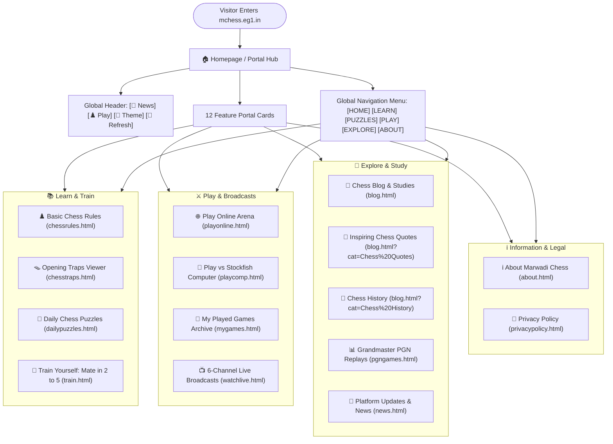

# ♟️ Marwadi Chess ([mchess.eg1.in](https://mchess.eg1.in)) — Website Pages & User Guide

Welcome to the official user guide for **Marwadi Chess** ([mchess.eg1.in](https://mchess.eg1.in)). Marwadi Chess is a free, web-based chess portal and learning platform designed to help chess enthusiasts of all skill levels—from complete beginners to tournament players—learn rules, practice tactics, study opening traps, replay grandmaster games, play vs AI engines or online opponents, review personal game archives, and watch live international broadcasts.

---

## 🗺️ Website Overview & Page Directory

| Page Name | Page URL | Category | Core Purpose & Visitor Experience |
| :--- | :--- | :--- | :--- |
| **Home Portal** | [`index.html`](index.html) | Navigation Hub | Main gateway featuring 12 interactive feature cards, latest updates, and community links. |
| **Play Online Arena** | [`playonline.html`](playonline.html) | Play & Multiplayer | Real-time online lobby, 1-click challenges, digital clocks, local Pass & Play, and club rooms. |
| **Play vs Computer** | [`playcomp.html`](playcomp.html) | Play & AI | Browser chess against Stockfish engine across 20 difficulty levels with instant side selection. |
| **Daily Chess Puzzles** | [`dailypuzzles.html`](dailypuzzles.html) | Training | Daily tactical puzzles with dynamic hints, solution viewer, and streak counter. |
| **Train Yourself** | [`train.html`](train.html) | Tactics & Training | Checkmate drills across Mate in 2 to Mate in 5, speed sprint challenges, and zen practice. |
| **Basic Chess Rules** | [`chessrules.html`](chessrules.html) | Learn | Beginner-friendly visual guide covering piece movements, castling, en passant, and checkmates. |
| **Learn Chess Traps** | [`chesstraps.html`](chesstraps.html) | Learn & Tactics | Interactive move-by-move viewer for famous opening traps and counter-tactics. |
| **PGN Games Database** | [`pgngames.html`](pgngames.html) | Study & Masters | Grandmaster game database with move notation tree, autoplay, and game-by-game analysis. |
| **Watch Top Live Games** | [`watchlive.html`](watchlive.html) | Broadcasts | 6-channel live broadcast center (Top GM, Blitz, Rapid, Bullet, Classical) with fullscreen mode. |
| **Chess Blog** | [`blog.html`](blog.html) | Articles & Reading | Categorized articles covering opening strategies, chess history, mate-in-N puzzles, and tactical studies. |
| **Website Updates** | [`news.html`](news.html) | Platform & News | Release notes, engine updates, feature announcements, and platform changelog. |
| **My Played Games Archive** | [`mygames.html`](mygames.html) | Play & History | Personal match history dashboard with victory stats, win rate %, search, replay board, and PGN export. |
| **About Us** | [`about.html`](about.html) | Information | Mission statement, learning philosophy, and platform background. |
| **Privacy Policy** | [`privacypolicy.html`](privacypolicy.html) | Legal | User privacy terms, cookie information, and website usage policies. |

---

## 🧭 User Navigation Flow

The following diagram illustrates how visitors navigate across the Marwadi Chess web platform:



---

## 📐 Page Wireframes & Layout Structures

### 1. Global Standard Page Template
All pages share a consistent, responsive layout structure:

```
┌───────────────────────────────────────────────────────────────────────────────┐
│ [LOGO] Marwadi Chess       [🔔 News]  [♟️ Play Online]  [🌙 Theme]  [🔄 Refresh]│ Header
├───────────────────────────────────────────────────────────────────────────────┤
│ HOME  |  LEARN ▾  |  PUZZLES ▾  |  PLAY ▾  |  EXPLORE ▾  |  ABOUT             │ Sticky Nav
├───────────────────────────────────────────────────────────────────────────────┤
│                                                                               │
│  Page Heading / Breadcrumb Title                                              │
│  ───────────────────────────────────────────────────────────────────────────  │
│                                                                               │
│  ┌──────────────────────────────────────────────┐ ┌────────────────────────┐  │
│  │                                              │ │ Side Column:           │  │ Main
│  │          Main Interactive Content            │ │ - Community Card       │  │ Content
│  │     (Chessboard / PGN Replay / Article)      │ │ - Social Links         │  │ Area
│  │                                              │ │ - Quick Categories     │  │
│  └──────────────────────────────────────────────┘ └────────────────────────┘  │
│                                                                               │
├───────────────────────────────────────────────────────────────────────────────┤
│ Brand Summary  |  Chess Puzzles  |  Explore Links  |  Social Channels         │ Footer
│ © 2026 Marwadi Chess  |  Privacy Policy  |  Back to Top Button [^]            │
└───────────────────────────────────────────────────────────────────────────────┘
```

> **Navigation Menu Dropdown Hierarchy**:
> - **HOME**: Gateway to all 12 feature portals and quick-start links.
> - **LEARN ▾**: Basic Chess Rules, Learn Chess Traps, Watch Top Live Games, PGN Games Database, Train Yourself.
> - **PUZZLES ▾**: Train Yourself, Daily Chess Puzzle, Mate in 2, Mate in 3, Mate in 4, Mate in N.
> - **PLAY ▾**: Play Online, Play vs Computer, My Played Games.
> - **EXPLORE ▾**: Website Updates, Latest Blog, Chess Quotes, Chess History.
> - **ABOUT**: Platform background and learning mission.

---

### 2. Homepage Wireframe (`index.html`)

```
┌───────────────────────────────────────────────────────────────────────────────┐
│                           Marwadi Chess Welcome Hub                           │
├───────────────────┬───────────────────┬───────────────────┬───────────────────┤
│ 🌐 Play Online    │ 🤖 Play Computer  │ 🧩 Daily Puzzles  │ 🎯 Train Yourself │
│ Live timed games  │ Stockfish engine  │ Daily tactics &   │ 500+ curated mate │
│ & player lobby    │ 20 levels & hints │ solving trainer   │ puzzles in 2 to 5 │
├───────────────────┼───────────────────┼───────────────────┼───────────────────┤
│ ♟️ Basic Rules    │ 🪤 Chess Traps    │ 📊 PGN Database   │ 📺 Watch Live     │
│ Visual beginner   │ Master tactical   │ Grandmaster game  │ 6 live tournament │
│ movement guide    │ opening traps     │ archive & replay  │ broadcast channels│
├───────────────────┼───────────────────┼───────────────────┼───────────────────┤
│ 📰 Chess Blog     │ 💬 Chess Quotes   │ 🔔 Updates & News │ ℹ️ About Platform │
│ Tactical studies  │ Inspiring quotes  │ Changelogs, new   │ Mission statement │
│ & opening guides  │ & tactical vision │ features & notes  │ & learning goals  │
└───────────────────┴───────────────────┴───────────────────┴───────────────────┘
```

---

### 3. Play Online Arena Wireframe (`playonline.html`)

```
┌───────────────────────────────────────────────────────────────────────────────┐
│ Player Identity: [ Gautam ] [ ✏️ Edit ]            [ 📜 My Played Games Archive ]│
├───────────────────────────────────────────────────────────────────────────────┤
│ VIEW 1: LOBBY & MATCHMAKING                                                   │
│ ┌───────────────────────────────────────────────────────────────────────────┐ │
│ │ 🟢 Online Players in Lobby                                                │ │
│ │ Player Name          | Preferred Time | Status             | Action       │ │
│ │ - Gautam (You)       | 5m Blitz       | Available          | (You)        │ │
│ │ - Grandmaster_AJ     | 3m Blitz       | Available          | [⚔️Challenge]│ │
│ └───────────────────────────────────────────────────────────────────────────┘ │
│ ┌───────────────────────────────────────┐ ┌─────────────────────────────────┐ │
│ │ 🔗 Direct Match Link Generator        │ │ 👥 Local Pass & Play            │ │
│ └───────────────────────────────────────┘ └─────────────────────────────────┘ │
│ ┌───────────────────────────────────────────────────────────────────────────┐ │
│ │ 🏆 Affiliated Club Hubs: Marwadi on Lichess | ChessBase Playchess Room    │ │
│ └───────────────────────────────────────────────────────────────────────────┘ │
├───────────────────────────────────────────────────────────────────────────────┤
│ VIEW 2: LIVE MATCH ARENA (Active Match)                                       │
│ White: Player 1 [ 05:00 ]          [ Active Match ]         Black: Player 2 [ 05:00]│
│ ┌──────────────────────────────────────────┐ ┌──────────────────────────────┐ │
│ │                                          │ │ Live Move Notation History   │ │
│ │          INTERACTIVE CHESSBOARD          │ │ 1. e4 e5                     │ │
│ │                                          │ │ 2. Nf3 Nc6                   │ │
│ └──────────────────────────────────────────┘ └──────────────────────────────┘ │
│ [ 🚩 Resign ]     [ 🤝 Offer Draw ]     [ 🔄 Flip Board ]     [ 🚪 Leave Match ]│
└───────────────────────────────────────────────────────────────────────────────┘
```

---

### 4. Play vs Stockfish Computer Wireframe (`playcomp.html`)

```
┌───────────────────────────────────────────────────────────────────────────────┐
│ Page Title: Play vs Stockfish Computer Engine                                 │
│ Status Banner: "Your turn (White). Stockfish Skill: Level 10 (Master)"         │
├────────────────────────────────────────────┬──────────────────────────────────┤
│                                            │ White Clock: 05:00               │
│                                            │ Black Clock: 05:00               │
│          INTERACTIVE CHESSBOARD            ├──────────────────────────────────┤
│                                            │ Side: [ Play as White / Black ♚ ]│
│                                            │ Difficulty: [ Level 1 to 20 ]    │
│                                            ├──────────────────────────────────┤
│                                            │ Move Notation History:           │
│                                            │ 1. e4 e5  2. Nf3 Nc6             │
├────────────────────────────────────────────┴──────────────────────────────────┤
│ Toolbar: [ New Game ]  [ Undo Move ]  [ Hint ]  [ Flip Board ]  [ Sound 🔊 ]  │
└───────────────────────────────────────────────────────────────────────────────┘
```

---

### 5. My Played Games Archive Wireframe (`mygames.html`)

```
┌───────────────────────────────────────────────────────────────────────────────┐
│ Page Title: My Played Games Archive                                           │
│ [ 🤖 Play vs Computer ]                         [ 🌐 Play Online Arena ]      │
├────────────────────┬───────────────────┬───────────────────┬──────────────────┤
│ Total Matches: 14  │ Victories: 9      │ Defeats: 3        │ Win Rate: 64%    │
├────────────────────┴───────────────────┴───────────────────┴──────────────────┤
│ MOVE REPLAY BOARD CONTAINER (Expands on "Review")                             │
│ Match: Gautam vs Stockfish (2026.08.26)       [ 💾 Download PGN ] [ ✖ Close ] │
│ ┌──────────────────────────────────────────┐ ┌──────────────────────────────┐ │
│ │         INTERACTIVE REPLAY BOARD         │ │ 1. e4 e5  2. Nf3 Nc6         │ │
│ └──────────────────────────────────────────┘ └──────────────────────────────┘ │
│ [ |◀ First ]  [ ◀ Prev ]  [ ▶ Next ]  [ Last ▶| ]  [ 🔄 Flip ]  [ ⏯ Autoplay ]│
├───────────────────────────────────────────────────────────────────────────────┤
│ [ Filter: All | Wins | Losses | Draws ]   [ 🔍 Search ]   [ 📦 Export All PGN ]│
│ ┌───────────────────────────────────────────────────────────────────────────┐ │
│ │ Date       | Matchup           | Mode        | Result | Moves | Actions   │ │
│ │ 26/08/2026 | You vs Stockfish  | vs Computer | 1-0    | 34    | Review/PGN│ │
│ └───────────────────────────────────────────────────────────────────────────┘ │
└───────────────────────────────────────────────────────────────────────────────┘
```

---

### 6. Watch Top Live Games Wireframe (`watchlive.html`)

```
┌───────────────────────────────────────────────────────────────────────────────┐
│ Page Title: Live Multi-Channel Chess Broadcasts (6 Channels)                  │
├───────────────────────────────────────────────────────────────────────────────┤
│ [ All 6 Channels ] [ 🏆 TOP GM ] [ ⚡ BLITZ ] [ ⏱ RAPID ] [ 🔥 BULLET ]        │
├───────────────────────────────────────────────────────────────────────────────┤
│ ┌────────────────────────┐ ┌────────────────────────┐ ┌─────────────────────┐ │
│ │ 🏆 Top GM Broadcast    │ │ ⚡ Blitz Championship  │ │ ⏱ Rapid Stream      │ │
│ │ [ LIVE ] [ ⛶ Fullscreen]│ │ [ LIVE ] [ ⛶ Fullscreen]│ │ [ LIVE ] [ ⛶ ]    │ │
│ │ [ Live Board 1 ]       │ │ [ Live Board 2 ]       │ │ [ Live Board 3 ]    │ │
│ └────────────────────────┘ └────────────────────────┘ └─────────────────────┘ │
│ ┌────────────────────────┐ ┌────────────────────────┐ ┌─────────────────────┐ │
│ │ 🔥 Bullet Speed Channel│ │ 👑 Classical Tournament│ │ 🚀 UltraBullet      │ │
│ │ [ LIVE ] [ ⛶ Fullscreen]│ │ [ LIVE ] [ ⛶ Fullscreen]│ │ [ LIVE ] [ ⛶ ]    │ │
│ │ [ Live Board 4 ]       │ │ [ Live Board 5 ]       │ │ [ Live Board 6 ]    │ │
│ └────────────────────────┘ └────────────────────────┘ └─────────────────────┘ │
├───────────────────────────────────────────────────────────────────────────────┤
│ FULLSCREEN MODAL OVERLAY (Click any board to view in edge-to-edge mode)       │
└───────────────────────────────────────────────────────────────────────────────┘
```

---

## 📄 Detailed Page-by-Page Guide

### 1. 🏠 Homepage ([index.html](index.html))
- **Purpose**: The primary central lobby connecting users to all tools, games, puzzles, and articles.
- **Key Features**:
  - **Top Interactive Header**: Quick access buttons (`Notifications 🔔`, `Play Online ♟️`, `Theme Toggle 🌙/☀️`, and `Refresh 🔄`).
  - **12 Feature Cards**: Clean 4-line uniform feature cards with direct navigation to all portals.
  - **Social Links**: Quick access to Facebook Club, X (Twitter), YouTube, and Instagram.

---

### 2. 🌐 Play Online Arena ([playonline.html](playonline.html))
- **Purpose**: Real-time chess arena for playing with friends or online opponents.
- **Key Features**:
  - **Live Online Lobby**: View active online players and their preferred time controls (3m, 5m, 10m, 30m).
  - **1-Click Match Challenges**: Challenge any player instantly with real-time Accept/Decline notifications.
  - **Live Match Arena**: Play with digital clocks, move list notation, board flip, draw offers, and resign options.
  - **Seamless Reconnection**: Accidental browser refreshes or momentary disconnections seamlessly restore your active game and move progress within a 30-second grace window.
  - **Same-Screen Pass & Play**: Play over-the-board games with friends on a shared device.
  - **Club Hubs**: Direct links to official Marwadi Chess club rooms on Lichess and ChessBase Playchess.

---

### 3. 🤖 Play vs Computer ([playcomp.html](playcomp.html))
- **Purpose**: Single-player practice arena against the world-class Stockfish chess engine.
- **Key Features**:
  - **20 Difficulty Levels**: Practice from beginner level (Level 1) all the way to grandmaster level (Level 20).
  - **Instant Play as Black**: Switching to "Play as Black ♚" automatically starts the game and instructs Stockfish to make the opening White move immediately.
  - **Tactical Aids**: Request engine move hints, navigate move history forward/backward, and undo moves.
  - **Match Archiving**: Automatically saves finished games into your personal match history.

---

### 4. 🧩 Daily Chess Puzzles ([dailypuzzles.html](dailypuzzles.html))
- **Purpose**: Daily calculation and tactical pattern trainer.
- **Key Features**:
  - Solves daily tactics powered by official Lichess API and Stockfish engine move solver.
  - Interactive board with move hints, solution viewer, and consecutive daily streak counter.

---

### 5. 🎯 Train Yourself ([train.html](train.html))
- **Purpose**: Dedicated tactical training center for mastering forced checkmates.
- **Key Features**:
  - **500+ Curated Puzzles**: Categorized by Mate in 2, Mate in 3, Mate in 4, and Mate in 5.
  - **Speed Sprint Drills**: Timed puzzle solving sprints to test calculation speed under pressure.
  - **Zen Practice**: Calm, untimed puzzle solving for deep calculation and positional mastery.

---

### 6. ♟️ Basic Chess Rules ([chessrules.html](chessrules.html))
- **Purpose**: Educational guide for beginners learning fundamental chess rules.
- **Topics Covered**:
  - Board Setup and Coordinates (Files `a-h`, Ranks `1-8`).
  - Individual Piece Movements: Pawn, Knight, Bishop, Rook, Queen, and King.
  - Special Moves: Castling (Kingside & Queenside), En Passant, and Pawn Promotion.
  - Check, Checkmate, and Stalemate / Draw conditions.

---

### 7. 🪤 Learn Chess Traps ([chesstraps.html](chesstraps.html))
- **Purpose**: Tactical study tool focusing on famous opening pitfalls and counter-strategies.
- **Key Features**:
  - Interactive board with step-by-step move stepping and autoplay mode.
  - Famous traps covered: Scholar's Mate, Fried Liver Attack, Legal's Trap, Elephant Trap, Blackburne Shilling Gambit, and more.

---

### 8. 📊 PGN Games Database ([pgngames.html](pgngames.html))
- **Purpose**: Grandmaster game library and historical tournament collection.
- **Key Features**:
  - Complete PGN game record replay with move-by-move notation tree.
  - Autoplay mode, board flipping, and interactive move jumping.

---

### 9. 📺 Watch Top Live Games ([watchlive.html](watchlive.html))
- **Purpose**: Live spectator portal for following international grandmaster tournaments.
- **Key Features**:
  - **6 Dedicated Channels**: Top GM, Blitz Championship, Rapid Stream, Bullet Speed, Classical Tournament, and UltraBullet.
  - **Category Filter Tabs**: Filter and view specific time-control broadcasts instantly.
  - **Click-to-Expand Fullscreen Mode**: Click any live board to view in an edge-to-edge high-definition view.

---

### 10. 📰 Chess Blog & Quotes ([blog.html](blog.html))
- **Purpose**: Multi-category publication hub with articles, game breakdowns, and motivational quotes.
- **Categories**:
  - **Tactical Studies**: In-depth explanations of tactical motifs and middlegame strategies.
  - **Chess Quotes**: Inspiring quotes from Marwadi Chess and legendary World Champions.
  - **Mate in 2 / 3 / 4 Puzzles**: Interactive FEN puzzle solving directly inside blog articles.
  - **Chess History**: Fascinating stories, famous historical games, and the origins of chess.

---

### 11. 🔔 Website Updates ([news.html](news.html))
- **Purpose**: Platform announcements, release notes, and feature changelogs.
- **Key Features**:
  - Chronological updates feed detailing engine improvements, new puzzles, UI updates, and bug fixes.
  - Linked directly to the header Notification Bell `[🔔]` for instant announcements.

---

### 12. 📜 My Played Games Archive ([mygames.html](mygames.html))
- **Purpose**: Personal match history dashboard and performance tracker.
- **Key Features**:
  - **Performance Stats**: Total matches, victories, defeats, draws, and win rate %.
  - **Interactive Replay Board**: Step through any played game with forward, backward, autoplay, and flip controls.
  - **Filter & Search**: Filter by outcome (Wins, Losses, Draws) or search by player name, date, or game mode.
  - **PGN Downloads**: Download individual game PGN files or export your entire archive in one file.

---

### 13. ℹ️ About Us ([about.html](about.html))
- **Purpose**: Learn about the mission of Marwadi Chess, our learning philosophy, and our dedication to providing accessible chess tools for everyone.

---

### 14. 📄 Privacy Policy ([privacypolicy.html](privacypolicy.html))
- **Purpose**: Clear, transparent explanation of website terms, user privacy, cookies, and community guidelines.

---

## 📱 Mobile Responsiveness & Top Bar Actions

Marwadi Chess is fully responsive and optimized across all screen sizes:
- **Desktop (920px+)**: Full multi-column view with sidebar widgets, sticky navigation, and wide tournament chessboards.
- **Tablet (768px – 919px)**: Adaptive layout with touch-friendly navigation and balanced board scaling.
- **Mobile (< 768px)**: Single-column responsive layout with toggle navigation menu, edge-to-edge board scaling, and tap-to-move piece controls.

### Header Quick Actions:
- **`[ 🔔 ]` What's New**: Opens a dropdown panel with the latest feature announcements.
- **`[ ♟️ Play Online ]`**: One-click shortcut to the live multiplayer lobby.
- **`[ 🌙 Dark Mode / ☀️ Light Mode ]`**: Instant theme switching saved to your device.
- **`[ 🔄 ]` 1-Click Refresh**: Clears stale browser caches and fetches the latest version of the website with active game protection.

---

## 📜 License

This project is open source and available under the [MIT License](LICENSE).
