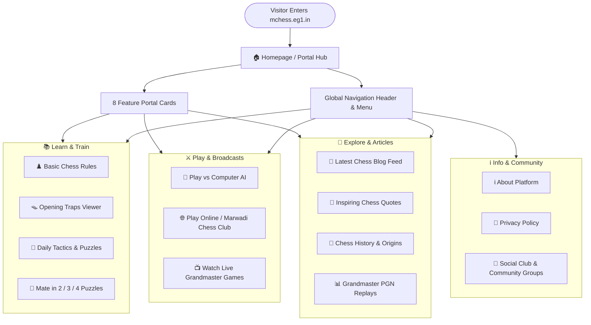

# ♟️ Marwadi Chess (`mchess.eg1.in`) — Website Pages & User Guide

Welcome to the official user guide for **Marwadi Chess** (`mchess.eg1.in`). Marwadi Chess is a web-based chess portal and learning platform designed to help chess enthusiasts of all levels—from complete beginners to tournament players—learn rules, practice tactics, study opening traps, replay grandmaster games, and play chess online.

---

## 🗺️ Website Overview & Page Directory

| Page Name | Page URL | Category | Core Purpose & Visitor Experience |
| :--- | :--- | :--- | :--- |
| **Home Portal** | `index.html` | Navigation Hub | Main gateway featuring 8 interactive category cards, quick links, and social community feeds. |
| **Basic Chess Rules** | `chessrules.html` | Learn | Beginner-friendly visual guide covering piece movements, castling, en passant, promotion, and checkmate rules. |
| **Learn Chess Traps** | `chesstraps.html` | Learn & Tactics | Interactive move-by-move viewer for famous opening traps (Scholar's Mate, Fried Liver, Legal's Trap, etc.). |
| **Daily Chess Puzzles** | `dailypuzzles.html` | Training | Interactive tactical puzzle trainer featuring embedded solving boards from top chess servers. |
| **PGN Database** | `pgngames.html` | Study | Grandmaster game replay database with move notation tree, autoplay, and game-by-game analysis. |
| **Play vs Computer** | `playcomp.html` | Play | Play chess directly in your browser against AI chess engines with selectable difficulty levels. |
| **Play Online Chess** | `playonline.html` | Play & Social | Join the "Marwadi Chess Club" multiplayer room, challenge online players, and engage with community feeds. |
| **Watch Top Live Games** | `watchlive.html` | Broadcasts | Watch live streaming grandmaster tournaments and real-time top board broadcasts. |
| **Chess Blog & Quotes** | `blog.html` | Articles & Reading | Categorized articles covering opening strategies, chess history, mate-in-N puzzles, and inspiring grandmaster quotes. |
| **About Us** | `about.html` | Information | Mission statement, learning philosophy, and platform overview. |
| **Privacy Policy** | `privacypolicy.html` | Legal | User privacy terms, cookie information, and website usage policies. |

---

## 🧭 User Navigation Flow

The following diagram illustrates how visitors navigate across the Marwadi Chess web platform:



---

## 📐 Page Wireframes & Layout Structures

### 1. Global Standard Page Template
All pages share a consistent, responsive layout structure:

```
┌─────────────────────────────────────────────────────────────────────────┐
│ [LOGO] Marwadi Chess          [DAILY PUZZLE]  [PLAY ONLINE]  [SOCIAL]   │ Header
├─────────────────────────────────────────────────────────────────────────┤
│ HOME  |  MISC (Rules, Traps, PGN, Live, Play)  |  BLOG  |  ABOUT        │ Sticky Nav
├─────────────────────────────────────────────────────────────────────────┤
│                                                                         │
│  Page Heading / Breadcrumb Title                                        │
│  ─────────────────────────────────────────────────────────────────────  │
│                                                                         │
│  ┌──────────────────────────────────────────────┐ ┌──────────────────┐  │
│  │                                              │ │ Side Column:     │  │ Main
│  │          Main Interactive Content            │ │ - Community Card │  │ Content
│  │     (Chessboard / PGN Replay / Article)      │ │ - Social Embeds  │  │ Area
│  │                                              │ │ - Categories     │  │
│  └──────────────────────────────────────────────┘ └──────────────────┘  │
│                                                                         │
├─────────────────────────────────────────────────────────────────────────┤
│ Brand Summary  |  Chess Puzzles  |  Explore Links  |  Social Channels   │ Footer
│ © 2026 Marwadi Chess  |  Privacy Policy  |  Back to Top Button          │
└─────────────────────────────────────────────────────────────────────────┘
```

---

### 2. Homepage Wireframe (`index.html`)

```
┌─────────────────────────────────────────────────────────────────────────┐
│                         Marwadi Chess Welcome                           │
├────────────────────┬────────────────────┬────────────────────┬──────────┤
│ ♟️ Basic Rules     │ 🪤 Chess Traps     │ 🤖 Play Computer   │ 🌐 Online │
│ Learn how each     │ Master dangerous   │ Challenge AI       │ Join live│
│ piece moves        │ opening lines      │ chess engines      │ matches  │
├────────────────────┼────────────────────┼────────────────────┼──────────┤
│ 📺 Watch Live      │ 🧩 Daily Puzzles   │ 💬 Chess Quotes    │ 📰 Blog  │
│ Top grandmaster    │ Solve tactical     │ Mental strategy    │ Articles │
│ tournaments        │ checkmate drills   │ & wisdom           │ & guides │
└────────────────────┴────────────────────┴────────────────────┴──────────┘
```

---

### 3. Interactive PGN Game & Opening Trap Viewer Wireframe (`chesstraps.html` & `pgngames.html`)

```
┌─────────────────────────────────────────────────────────────────────────┐
│ Page Title: Chess Traps / Grandmaster PGN Database                      │
├────────────────────────────────────────┬────────────────────────────────┤
│                                        │ Game Notation & Move Tree      │
│               CHESSBOARD               │ 1. e4 e5                       │
│                                        │ 2. Nf3 Nc6                     │
│         [ 8x8 Interactive Grid ]       │ 3. Bc4 Bc5                     │
│                                        │ 4. Bxf7+ Kxf7                  │
│                                        │                                │
│                                        ├────────────────────────────────┤
│                                        │ [ ⏮ First ]  [ ◀ Prev ]        │
│                                        │ [ ▶ Next  ]  [ ⏭ Last ]        │
│                                        │ [ ⏯ Auto-Play ]                │
└────────────────────────────────────────┴────────────────────────────────┘
```

---

### 4. Chess Blog & Articles Wireframe (`blog.html`)

```
┌──────────────────────────────────────────┬──────────────────────────────┐
│ Article Feed / Selected Article          │ 🔍 Search Bar                │
│ ───────────────────────────────────────  │ [ Type keyword... ] [Search] │
│ 📰 Article Title Headline                │                              │
│ By Marwadi Chess • Category: Learn Chess │ 📁 Categories:               │
│                                          │ • Learn Chess (12)           │
│ [ Article Cover Image / Board Diagram ]  │ • Chess Quotes (18)          │
│                                          │ • Mate in 2 (15)             │
│ Full text analysis, diagrams, and tips   │ • Mate in 3 (10)             │
│ for improving your chess game...         │ • Mate in 4 (8)              │
│                                          │ • Chess History (6)          │
│ ───────────────────────────────────────  ├──────────────────────────────┤
│ [ « Previous Post ]    [ Next Post » ]   │ 🔗 Related Topics            │
└──────────────────────────────────────────┴──────────────────────────────┘
```

---

## 📄 Detailed Page-by-Page Guide

### 1. 🏠 Homepage (`index.html`)
- **Purpose**: The main central lobby connecting users to all tools, training modules, games, and articles.
- **Key Elements**:
  - Top interactive header with direct action buttons (`Solve Daily Puzzles`, `Play Online`).
  - 8 Feature Cards with custom chess iconography.
  - Social platform access to Facebook Club, X (Twitter), YouTube, and Instagram.

---

### 2. ♟️ Basic Chess Rules (`chessrules.html`)
- **Purpose**: Educational reference for new players learning the fundamental rules of chess.
- **Topics Covered**:
  - Board Setup and Coordinates (Files `a-h`, Ranks `1-8`).
  - Individual Piece Movements: Pawn, Knight, Bishop, Rook, Queen, and King.
  - Special Moves: Castling (Kingside and Queenside), En Passant, and Pawn Promotion.
  - Check, Checkmate, and Stalemate / Draw conditions.

---

### 3. 🪤 Learn Chess Traps (`chesstraps.html`)
- **Purpose**: Interactive tactical study tool focusing on famous opening pitfalls and counter-strategies.
- **Features**:
  - Embedded interactive board supporting move-by-move stepping.
  - Step Forward/Backward controls and Autoplay demonstration mode.
  - Classic opening traps including Scholar's Mate, Legal's Trap, Fried Liver Attack, Elephant Trap, and more.

---

### 4. 🧩 Daily Chess Puzzles (`dailypuzzles.html`)
- **Purpose**: Daily calculation and tactical pattern training.
- **Features**:
  - Live tactics trainer embedded from premier chess platforms (ChessBase & Lichess).
  - Practice puzzles ranging from 1-move tactics to complex multi-move combinations.
  - Sidebar with community join link for the **Marwadi Chess Group** on Facebook.

---

### 5. 📊 PGN Database (`pgngames.html`)
- **Purpose**: Master-level game analysis and classic game library.
- **Features**:
  - Complete PGN game record replay.
  - Move-by-move notation highlighting.
  - Board orientation and interactive move jumping.

---

### 6. 🤖 Play vs Computer (`playcomp.html`)
- **Purpose**: Single-player practice arena against automated chess engines.
- **Features**:
  - Play full chess games against chess engines (such as Fritz and Cinnamon engines).
  - Adjustable skill and difficulty levels.
  - Clean, distraction-free board interface.

---

### 7. 🌐 Play Online Chess (`playonline.html`)
- **Purpose**: Multiplayer hub for playing with human opponents across the globe.
- **Features**:
  - Direct entry to the dedicated **"Marwadi Chess Club"** online room.
  - Guest access and registered username support.
  - Social widgets, Facebook community updates, and Instagram feeds.

---

### 8. 📺 Watch Top Live Games (`watchlive.html`)
- **Purpose**: Spectator portal for following top-tier chess tournaments in real time.
- **Features**:
  - Live game board broadcasts from international Grandmaster events.
  - Move transmission and real-time position updates.

---

### 9. 📰 Chess Blog & Quotes (`blog.html`)
- **Purpose**: Multi-category publication hub with articles, game breakdowns, and motivational quotes.
- **Sections & Categories**:
  - **Learn Chess**: Strategic guides on opening principles, middlegame planning, and endgames.
  - **Chess Quotes**: Inspiring quotes from legends (Kasparov, Fischer, Tal, Capablanca, Lasker).
  - **Mate in 2 / 3 / 4**: Tactical checkmate puzzles for focused calculation practice.
  - **Chess History**: Historical stories, legendary matches, and the origins of chess.
  - **Search & Filter**: Keyword search bar and instant category navigation.

---

### 10. ℹ️ About Us (`about.html`)
- **Purpose**: Overview of Marwadi Chess, its educational goals, philosophy on chess improvement, and commitment to the chess community.

---

### 11. 📄 Privacy Policy (`privacypolicy.html`)
- **Purpose**: Clear, transparent explanation of website terms, user privacy, cookies, and community guidelines.

---

## 📱 Mobile Responsiveness & Accessibility

All pages on Marwadi Chess are designed with responsive layouts:
- **Desktop (920px+)**: Full multi-column view with sidebar widgets, sticky navigation, and wide chessboards.
- **Tablet (768px – 919px)**: Adaptive 2-column layout with touch-friendly navigation.
- **Mobile (< 768px)**: Single-column responsive layout with toggle navigation menu, stacked boards, and optimized font sizes.
