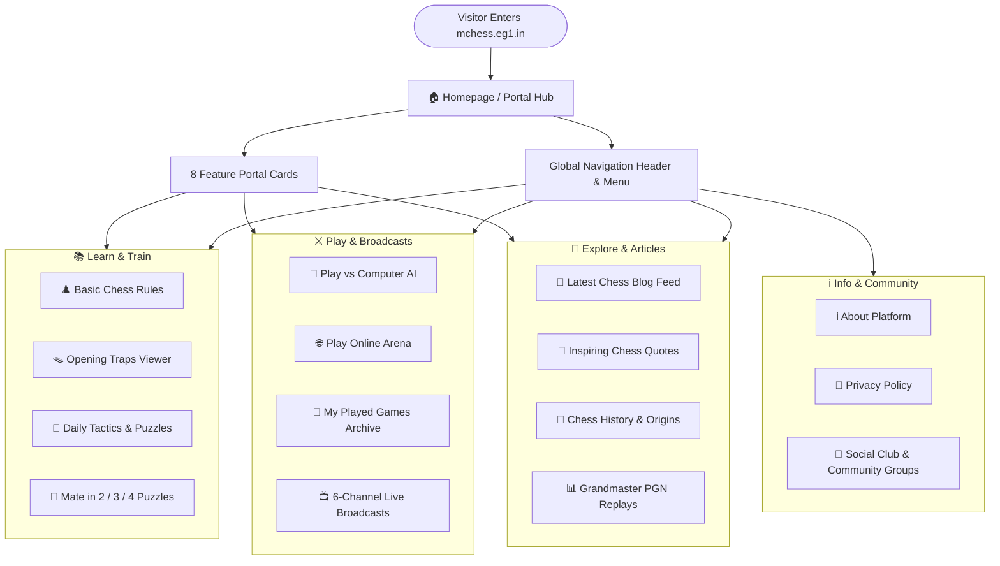

# ♟️ Marwadi Chess ([mchess.eg1.in](https://mchess.eg1.in)) — Website Pages & User Guide

Welcome to the official user guide for **Marwadi Chess** ([mchess.eg1.in](https://mchess.eg1.in)). Marwadi Chess is a web-based chess portal and learning platform designed to help chess enthusiasts of all levels—from complete beginners to tournament players—learn rules, practice tactics, study opening traps, replay grandmaster games, play vs AI engines or online opponents, review personal game archives, and watch live international broadcasts.

---

## 🗺️ Website Overview & Page Directory

| Page Name | Page URL | Category | Core Purpose & Visitor Experience |
| :--- | :--- | :--- | :--- |
| **Home Portal** | [`index.html`](index.html) | Navigation Hub | Main gateway featuring 8 interactive category cards, quick links, and social community feeds. |
| **Basic Chess Rules** | [`chessrules.html`](chessrules.html) | Learn | Beginner-friendly visual guide covering piece movements, castling, en passant, promotion, and checkmate rules. |
| **Learn Chess Traps** | [`chesstraps.html`](chesstraps.html) | Learn & Tactics | Interactive move-by-move viewer for famous opening traps (Scholar's Mate, Fried Liver, Legal's Trap, etc.). |
| **Daily Chess Puzzles** | [`dailypuzzles.html`](dailypuzzles.html) | Training | Interactive tactical puzzle trainer featuring embedded solving boards from top chess servers. |
| **PGN Database** | [`pgngames.html`](pgngames.html) | Study | Grandmaster game replay database with move notation tree, autoplay, and game-by-game analysis. |
| **Play vs Computer** | [`playcomp.html`](playcomp.html) | Play | Play chess directly in your browser against AI chess engines with selectable difficulty levels. |
| **Play Online Arena** | [`playonline.html`](playonline.html) | Play & Multiplayer | Real-time matchmaking lobby, 1-click player challenges with accept/decline popups, live match arena with chess clocks, local Pass & Play, and affiliated club rooms. |
| **My Played Games Archive** | [`mygames.html`](mygames.html) | Play & History | Personal match history archive with victory/defeat statistics, win rate %, live search, move-by-move interactive replay board, and single or multi-PGN downloads. |
| **Watch Top Live Games** | [`watchlive.html`](watchlive.html) | Broadcasts | 6-channel live broadcast center (Top GM, Blitz, Rapid, Bullet, Classical, UltraBullet) with filter tabs and click-to-expand edge-to-edge fullscreen board viewing. |
| **Chess Blog & Quotes** | [`blog.html`](blog.html) | Articles & Reading | Categorized articles covering opening strategies, chess history, mate-in-N puzzles, and inspiring grandmaster quotes. |
| **About Us** | [`about.html`](about.html) | Information | Mission statement, learning philosophy, and platform overview. |
| **Privacy Policy** | [`privacypolicy.html`](privacypolicy.html) | Legal | User privacy terms, cookie information, and website usage policies. |

---

## 🧭 User Navigation Flow

The following diagram illustrates how visitors navigate across the Marwadi Chess web platform:



---

## 📐 Page Wireframes & Layout Structures

### 1. Global Standard Page Template
All pages share a consistent, responsive layout structure:

```
┌─────────────────────────────────────────────────────────────────────────┐
│ [LOGO] Marwadi Chess          [DAILY PUZZLE]  [PLAY ONLINE]  [THEME 🌙] │ Header
├─────────────────────────────────────────────────────────────────────────┤
│ HOME  |  MISC (Rules, Traps, PGN, Live, Play, Archive)  |  BLOG  | ABOUT│ Sticky Nav
├─────────────────────────────────────────────────────────────────────────┤
│                                                                         │
│  Page Heading / Breadcrumb Title                                        │
│  ─────────────────────────────────────────────────────────────────────  │
│                                                                         │
│  ┌──────────────────────────────────────────────┐ ┌──────────────────┐  │
│  │                                              │ │ Side Column:     │  │ Main
│  │          Main Interactive Content            │ │ - Community Card │  │ Content
│  │     (Chessboard / PGN Replay / Article)      │ │ - Social Embeds  │  │ Area
│  │                                              │ │ - Categories     │  │
│  └──────────────────────────────────────────────┘ └──────────────────┘  │
│                                                                         │
├─────────────────────────────────────────────────────────────────────────┤
│ Brand Summary  |  Chess Puzzles  |  Explore Links  |  Social Channels   │ Footer
│ © 2026 Marwadi Chess  |  Privacy Policy  |  Back to Top Button          │
└─────────────────────────────────────────────────────────────────────────┘
```

---

### 2. Homepage Wireframe (`index.html`)

```
┌─────────────────────────────────────────────────────────────────────────┐
│                         Marwadi Chess Welcome                           │
├────────────────────┬────────────────────┬────────────────────┬──────────┤
│ ♟️ Basic Rules     │ 🪤 Chess Traps     │ 🤖 Play Computer   │ 🌐 Online │
│ Learn how each     │ Master dangerous   │ Challenge AI       │ Matchmaking│
│ piece moves        │ opening lines      │ chess engines      │ & lobby  │
├────────────────────┼────────────────────┼────────────────────┼──────────┤
│ 📺 Watch Live      │ 🧩 Daily Puzzles   │ 💬 Chess Quotes    │ 📰 Blog  │
│ 6 live tournament  │ Solve tactical     │ Mental strategy    │ Articles │
│ broadcast channels │ checkmate drills   │ & wisdom           │ & guides │
└────────────────────┴────────────────────┴────────────────────┴──────────┘
```

---

### 3. Play Online Arena Wireframe (`playonline.html`)

```
┌─────────────────────────────────────────────────────────────────────────┐
│ Player Identity: [ Gautam ] [ ✏️ Edit ]      [ 📜 My Played Games Archive ]│
├─────────────────────────────────────────────────────────────────────────┤
│ VIEW 1: LOBBY & MATCHMAKING                                             │
│ ┌─────────────────────────────────────────────────────────────────────┐ │
│ │ 🟢 Online Players in Lobby                                          │ │
│ │ Player Name        | Preferred Time | Status       | Action         │ │
│ │ - Gautam (You)     | 5m Blitz       | Available    | (You)          │ │
│ │ - Grandmaster_AJ   | 3m Blitz       | Available    | [ ⚔️ Challenge ]│ │
│ └─────────────────────────────────────────────────────────────────────┘ │
│ ┌───────────────────────────────────┐ ┌───────────────────────────────┐ │
│ │ 🔗 Direct Invite Link Generator   │ │ 👥 Local Pass & Play          │ │
│ └───────────────────────────────────┘ └───────────────────────────────┘ │
│ ┌─────────────────────────────────────────────────────────────────────┐ │
│ │ 🏆 Affiliated Club Hubs: Marwadi on Lichess | ChessBase Playchess   │ │
│ └─────────────────────────────────────────────────────────────────────┘ │
├─────────────────────────────────────────────────────────────────────────┤
│ VIEW 2: LIVE MATCH ARENA (Active Match)                                 │
│ White: Player 1 [ 05:00 ]      [ Active Match ]     Black: Player 2 [05:00]│
│ ┌──────────────────────────────────────┐ ┌───────────────────────────┐ │
│ │                                      │ │ Live Match Move Notation  │ │
│ │         INTERACTIVE CHESSBOARD       │ │ 1. e4 e5                  │ │
│ │                                      │ │ 2. Nf3 Nc6                │ │
│ └──────────────────────────────────────┘ └───────────────────────────┘ │
│ [ 🏳️ Resign ]   [ 🤝 Offer Draw ]   [ 🔄 Flip Board ]   [ 🚪 Leave Match ] │
└─────────────────────────────────────────────────────────────────────────┘
```

---

### 4. My Played Games Archive Wireframe (`mygames.html`)

```
┌─────────────────────────────────────────────────────────────────────────┐
│ Page Title: My Played Games Archive                                     │
│ [ 🤖 Play vs Computer ]                   [ 🌐 Play Online Arena ]      │
├────────────────────┬───────────────────┬───────────────────┬────────────┤
│ Total Matches: 14  │ Victories: 9      │ Defeats: 3        │ Win Rate:  │
│                    │                   │                   │ 64%        │
├────────────────────┴───────────────────┴───────────────────┴────────────┤
│ MOVE REPLAY BOARD CONTAINER (Expands on "Review")                       │
│ Heading: White vs Black (Date)            [ 💾 Download PGN ] [ ✖ Close ]│
│ ┌──────────────────────────────────────┐ ┌───────────────────────────┐ │
│ │         INTERACTIVE REPLAY BOARD     │ │ 1. e4 e5                  │ │
│ │                                      │ │ 2. Nf3 Nc6                │ │
│ └──────────────────────────────────────┘ └───────────────────────────┘ │
│ [ |◀ First ]  [ ◀ Prev ]  [ ▶ Next ]  [ Last ▶| ]  [ 🔄 Flip ]  [ ⏯ Auto ] │
├─────────────────────────────────────────────────────────────────────────┤
│ [ Filter: All | Wins | Losses | Draws ]   [ 🔍 Search ]   [ 📦 Export All ]│
│ ┌─────────────────────────────────────────────────────────────────────┐ │
│ │ Date       | Matchup           | Mode    | Result | Moves | Actions │ │
│ │ 21/08/2026 | You vs Stockfish  | vs AI   | 1-0    | 34    | Review/ │ │
│ │            |                   |         |        |       | PGN/Del │ │
│ └─────────────────────────────────────────────────────────────────────┘ │
└─────────────────────────────────────────────────────────────────────────┘
```

---

### 5. Watch Top Live Games Wireframe (`watchlive.html`)

```
┌─────────────────────────────────────────────────────────────────────────┐
│ Page Title: Live Multi-Channel Chess Broadcasts (6 Channels)            │
├─────────────────────────────────────────────────────────────────────────┤
│ [ All 6 Channels ] [ 🏆 TOP GM ] [ ⚡ BLITZ ] [ ⏱ RAPID ] [ 🔥 BULLET ]  │
├─────────────────────────────────────────────────────────────────────────┤
│ ┌────────────────────────┐ ┌────────────────────────┐ ┌───────────────┐ │
│ │ 🏆 Top GM Broadcast    │ │ ⚡ Blitz Championship  │ │ ⏱ Rapid Stream│ │
│ │ [ LIVE ] [ ⛶ Expand ]  │ │ [ LIVE ] [ ⛶ Expand ]  │ │ [ LIVE ][ ⛶ ] │ │
│ │ [ Live Board 1 ]       │ │ [ Live Board 2 ]       │ │ [ Live Board3]│ │
│ └────────────────────────┘ └────────────────────────┘ └───────────────┘ │
│ ┌────────────────────────┐ ┌────────────────────────┐ ┌───────────────┐ │
│ │ 🔥 Bullet Speed Channel│ │ 👑 Classical Tournament│ │ 🚀 UltraBullet│ │
│ │ [ LIVE ] [ ⛶ Expand ]  │ │ [ LIVE ] [ ⛶ Expand ]  │ │ [ LIVE ][ ⛶ ] │ │
│ │ [ Live Board 4 ]       │ │ [ Live Board 5 ]       │ │ [ Live Board6]│ │
│ └────────────────────────┘ └────────────────────────┘ └───────────────┘ │
├─────────────────────────────────────────────────────────────────────────┤
│ FULLSCREEN MODAL OVERLAY (Click any board to view in edge-to-edge mode) │
└─────────────────────────────────────────────────────────────────────────┘
```

---

## 📄 Detailed Page-by-Page Guide

### 1. 🏠 Homepage ([index.html](index.html))
- **Purpose**: The main central lobby connecting users to all tools, training modules, games, and articles.
- **Key Elements**:
  - Top interactive header with direct action buttons (`Solve Daily Puzzles`, `Play Online`) and Light/Dark mode toggle.
  - 8 Feature Cards with custom chess iconography.
  - Social platform access to Facebook Club, X (Twitter), YouTube, and Instagram.

---

### 2. ♟️ Basic Chess Rules ([chessrules.html](chessrules.html))
- **Purpose**: Educational reference for new players learning the fundamental rules of chess.
- **Topics Covered**:
  - Board Setup and Coordinates (Files `a-h`, Ranks `1-8`).
  - Individual Piece Movements: Pawn, Knight, Bishop, Rook, Queen, and King.
  - Special Moves: Castling (Kingside and Queenside), En Passant, and Pawn Promotion.
  - Check, Checkmate, and Stalemate / Draw conditions.

---

### 3. 🪤 Learn Chess Traps ([chesstraps.html](chesstraps.html))
- **Purpose**: Interactive tactical study tool focusing on famous opening pitfalls and counter-strategies.
- **Features**:
  - Embedded interactive board supporting move-by-move stepping.
  - Step Forward/Backward controls and Autoplay demonstration mode.
  - Classic opening traps including Scholar's Mate, Legal's Trap, Fried Liver Attack, Elephant Trap, and more.

---

### 4. 🧩 Daily Chess Puzzles ([dailypuzzles.html](dailypuzzles.html))
- **Purpose**: Daily calculation and tactical pattern training.
- **Features**:
  - Live tactics trainer with selectable difficulty levels.
  - Practice puzzles ranging from 1-move tactics to complex multi-move combinations.
  - Sidebar with community join link for the **Marwadi Chess Group** on Facebook.

---

### 5. 📊 PGN Database ([pgngames.html](pgngames.html))
- **Purpose**: Master-level game analysis and classic game library.
- **Features**:
  - Complete PGN game record replay.
  - Move-by-move notation highlighting.
  - Board orientation and interactive move jumping.

---

### 6. 🤖 Play vs Computer ([playcomp.html](playcomp.html))
- **Purpose**: Single-player practice arena against automated chess engines.
- **Features**:
  - Play full chess games against chess engines with adjustable difficulty levels.
  - Automatic game recording into your personal match history.
  - Clean, distraction-free board interface.

---

### 7. 🌐 Play Online Arena ([playonline.html](playonline.html))
- **Purpose**: Multiplayer hub for playing with human opponents across the globe.
- **Features**:
  - **Live Online Lobby**: See active players in real time with their preferred time controls.
  - **1-Click Match Challenges**: Instant challenge requests with real-time Accept/Decline notifications.
  - **Live Match Arena**: Play matches with live digital clocks, move notation, board flip, draw offers, and resign options.
  - **Same-Screen Pass & Play**: Play over-the-board games with friends on a shared device.
  - **Affiliated Club Rooms**: Direct access to the official Marwadi Chess Club rooms on Lichess and ChessBase Playchess.

---

### 8. 📜 My Played Games Archive ([mygames.html](mygames.html))
- **Purpose**: Dedicated match history dashboard and personal chess performance tracker.
- **Features**:
  - **Performance Statistics**: Real-time summary cards displaying Total Matches, Victories, Defeats, Draws, and Win Rate %.
  - **Move-by-Move Review Board**: Click "Review" on any played match to open an interactive replay board with forward, backward, autoplay, and flip board controls.
  - **Filter & Search**: Easily filter games by category (Wins, Losses, Draws) or search by player name, date, or game mode.
  - **PGN Downloads & Export**: Download individual game PGNs or export your entire game library in a single multi-PGN file.

---

### 9. 📺 Watch Top Live Games ([watchlive.html](watchlive.html))
- **Purpose**: Spectator portal for following top-tier chess tournaments in real time across multiple channels.
- **Features**:
  - **6 Dedicated Channels**: Top GM, Blitz Championship, Rapid Stream, Bullet Speed, Classical Tournament, and UltraBullet.
  - **1-Click Filter Toolbar**: Filter and isolate specific broadcast categories instantly.
  - **Click-to-Expand Fullscreen Mode**: Click any live board to expand it into an edge-to-edge, high-definition modal view.

---

### 10. 📰 Chess Blog & Quotes ([blog.html](blog.html))
- **Purpose**: Multi-category publication hub with articles, game breakdowns, and motivational quotes.
- **Sections & Categories**:
  - **Learn Chess**: Strategic guides on opening principles, middlegame planning, and endgames.
  - **Chess Quotes**: Inspiring quotes from legends (Kasparov, Fischer, Tal, Capablanca, Lasker).
  - **Mate in 2 / 3 / 4**: Tactical checkmate puzzles for focused calculation practice.
  - **Chess History**: Historical stories, legendary matches, and the origins of chess.
  - **Search & Filter**: Keyword search bar and instant category navigation.

---

### 11. ℹ️ About Us ([about.html](about.html))
- **Purpose**: Overview of Marwadi Chess, its educational goals, philosophy on chess improvement, and commitment to the chess community.

---

### 12. 📄 Privacy Policy ([privacypolicy.html](privacypolicy.html))
- **Purpose**: Clear, transparent explanation of website terms, user privacy, cookies, and community guidelines.

---

## 📱 Mobile Responsiveness & Accessibility

All pages on Marwadi Chess are built with responsive layouts:
- **Desktop (920px+)**: Full multi-column view with sidebar widgets, sticky navigation, and wide chessboards.
- **Tablet (768px – 919px)**: Adaptive layout with touch-friendly navigation and balanced board scaling.
- **Mobile (< 768px)**: Single-column responsive layout with toggle navigation menu, edge-to-edge board scaling, and tap-friendly touch targets.

---

## 📜 License

This project is open source and available under the [MIT License](LICENSE).
