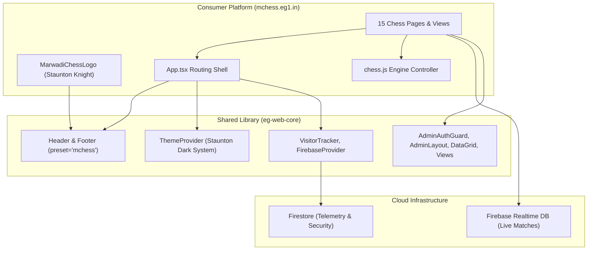

# Marwadi Chess Documentation Hub

Welcome to the technical documentation for **Marwadi Chess** ([`mchess.eg1.in`](../)). This platform is built with React 18, TypeScript, Vite, and `chess.js`, consuming the generic component framework [`eg-web-core`](https://github.com/EG1DOTIN/eg-web-core).

---

## 📚 Documentation Index

| Document | Focus & Scope | Key Topics Covered |
| :--- | :--- | :--- |
| **[Architecture & Chess Engine](./architecture.md)** | System architecture, `chess.js`, multiplayer sync & admin security | Realtime sync, AI engine opponent, board state evaluation, 3-tier auth |
| **[Pages & Feature Guide](./pages-and-features.md)** | Detailed implementation breakdown of all 15 pages | Online Play, AI Play, Training, Puzzles, Rules, Traps, PGN, Admin Studio |
| **[EG-Web-Core Library Docs](https://github.com/EG1DOTIN/eg-web-core/blob/main/docs/README.md)** | Shared component specifications | UI Primitives, Layouts, Hooks, Services, Admin Suite |

---

## 🧭 System Topology

```mermaid
graph TD
    subgraph Client["Consumer Platform (mchess.eg1.in)"]
        UI["15 Chess Pages & Views"]
        Brand["MarwadiChessLogo (Staunton Knight)"]
        Router["App.tsx Routing Shell"]
        Engine["chess.js Engine Controller"]
    end

    subgraph Core["Shared Library (eg-web-core)"]
        Layout["Header & Footer (preset='mchess')"]
        Theming["ThemeProvider (Staunton Dark System)"]
        AdminComponents["AdminAuthGuard, AdminLayout, DataGrid, Views"]
        Services["VisitorTracker, FirebaseProvider"]
    end

    subgraph Cloud["Cloud Infrastructure"]
        RealtimeDB["Firebase Realtime DB (Live Matches)"]
        Firestore["Firestore (Telemetry & Security)"]
    end

    UI --> Router
    Router --> Layout
    Router --> Theming
    UI --> Engine
    UI --> RealtimeDB
    Router --> Services
    Services --> Firestore
    UI --> AdminComponents
    Brand --> Layout
```

---

## 🛡️ Guidelines & Rules Compliance

1. **Modernized Consumer Architecture (Critical Rule 1)**:
   - This project is an independent, modernized React 18 + Vite + TypeScript application consuming `eg-web-core` as a modular dependency (`github:EG1DOTIN/eg-web-core`).
   - All generic, reusable components, styling, logic, hooks, and helpers are maintained in `eg-web-core`, while site-specific branding, customized wrappers, and domain pages reside strictly within this repository.
2. **Generic Core Library (Critical Rule 5)**:
   - All chess branding (`MarwadiChessLogo`, allowed admin emails, board themes) resides strictly inside this consumer project.
   - Core library components receive configuration via props and presets.
3. **Cross-Consumer Stability (Critical Rule 6)**:
   - Zero-regression builds confirmed with sibling projects `eg1.in` and `av.eg1.in`.
